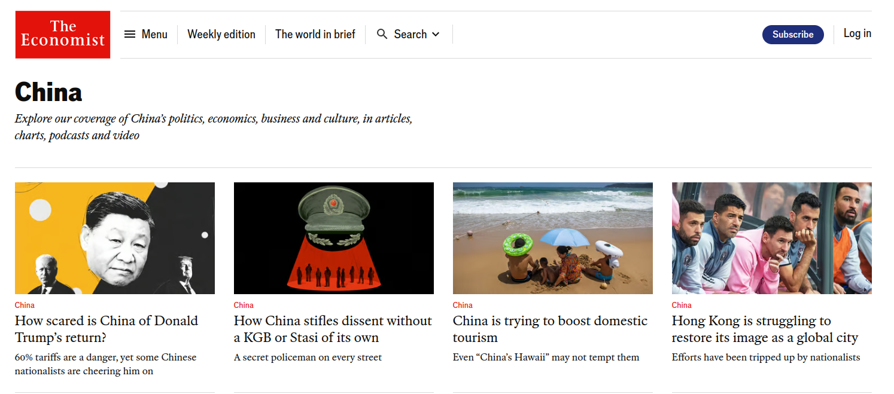

## 项目概览
本项目提供一个英语单词学习工具，专为英语学习者设计，通过阅读英文或双语文章来扩充词汇库。用户能够自动提取学习文章中的单词、统计词频、筛选过滤，同时跟踪和记录单词掌握程度。

## 功能特点
- **单词提取与记录**：输入一个网址，工具自动检索网页文章并提取里面的所有单词和它们的语境句子。同时，会计算并展示文章的词汇量。
- **智能管理与筛选**：避免重复学习您已知晓的单词，通过去重功能和排除掉您已掌握词汇选项以集中精力学习新词汇。
- **学习进度跟踪**：单词可标记为不同认知等级，包括“0:陌生”，“1:了解”，“2:认识”，“3:熟悉”。这有助于定制化学习路径，同时加深记忆。
- **筛选浏览功能**：过滤出特定认知等级的单词，例如选定标记“0”能显示所有您尚不了解的单词。
- **同步和平台兼容性**： 基于`Go`和`Flutter`开发的跨平台应用，支持在 Android、Linux 和 Windows 使用，支持设备间数据同步，便捷学习不受限制。
- **本地数据存储**：无需依赖后台服务器，确保所有数据均在本地安全存储，支持本地备份、本地恢复。

## 开发与技术支持
该工具的开发考虑到跨平台兼容性和用户方便性，不仅采用了性能优良的`go`语言实核心逻辑，同时以flutter保证了良好的用户界面体验和跨平台的一致性。用户无论在何种设备上学习，都能确保学习进展无缝同步。

立足于学习英语的需求，我们的目标是创建一个简洁、高效且用户友好的单词学习辅助工具。欢迎使用本工具加速您的语言学习旅程。


## 阅读与词汇量提升
阅读英文文章被广泛认为是提高词汇量的有效手段。根据数据分析，每篇英文文章中约有50%至70%的有效词汇。请注意，已经自动剔除了文章中的标点符号、冠词、介词等简单词汇（例如a, in, on, the, I, than, you, he等）。我们建议你应该：

- **坚持每天阅读**：形成每日阅读英文文章的习惯，无论是新闻、专业论文或是小说。
- **记录新词汇**：遇到新单词时，利用本工具记录下来，并分类它们的认知程度。

## 进步的衡量
持续的阅读实践将直接反映在你词汇量的增长上。随着时间的积累，你会发现：

- **“0级陌生单词”减少**：读每一篇新文章时，遇到完全不认识的单词数量会逐渐减少。
- **读懂文章的速度提升**：你会越来越快地读懂文章，理解深度和速度都会有显著提升。

坚持在阅读中实践并使用工具来辅助你记录和回顾这些新词汇，是促进你英语能力提高的关键。随着你词汇量的增加，不仅能更流畅地阅读，更能提升写作和对话能力。

## 学习资源推荐
为了有效使用本工具并提升你的英语水平，本项目推荐以下英文阅读资源，它们不仅提供了丰富的双语内容，还覆盖了广泛的主题，适合各水平的学习者:

- **The New York Times 中英文版**：访问[The New York Times 中英文版](https://cn.nytimes.com/zh-hant/)来获取优质的双语阅读材料，这将有助于提升你的英语理解能力和词汇量。
  
- **The Economist China 经济学人-中国**: [The Economist China](https://www.economist.com/topics/china): 贴近中国读者的英语内容，覆盖政治、经济、科技等领域，对于希望深入了解全球话题的学习者来说非常有益。
  
利用这些资源，您不仅能够有针对性地扩充您的词汇，也可以深入了解不同的话题和背景知识，全方位提升英语能力。

## 开始使用指南
想要开始使用这个英语单词学习工具，你需要根据你的使用平台选择正确的编译指令进行编译操作：
- **编译前提**：
  - 请确保你的设备上已经安装了`go`语言环境和`flutter`开发环境。
  - 请确保你的设备上已经安装了`make`、`zip`等工具。
  - Windows 环境下，需要对CGO进行支持
    - 如果没有安装对应的 CGO 运行时环境、则在运行的时候会引发如下错误。
      > exec: “gcc”: executable file not found in %PATH%
        - Windows GO 语言 CGO 运行时环境配置
            - https://www.expoli.tech/articles/2022/10/18/1666087321618
        - Make for Windows
            - https://gnuwin32.sourceforge.net/packages/make.htm
            - Complete package, except sources
- **安装指南**：
  - 对于**安卓用户**：在终端执行 `make build-android`。
  - 对于**Linux用户**：在终端执行 `make build-linux`。
  - 对于**Windows用户**：在终端执行 `make build-windows`。

- **安装包位置**：
  编译完成后，相应的安装包文件将会位于项目的"bin"文件夹内。按照标准流程安装到您的设备上后即可开始使用。

按照上述步骤安装并启用本工具，你就可以便捷地在阅读英文文章时提取关键词汇，并加以跟踪和复习，以强化你的语言学习过程。
## 项目结构
```
├── bin                   # 编译后的项目文件目录，安卓为.apk，Linux为.deb，Windows为.zip
├── mywords-go            # 用于编译SO库的go核心逻辑源代码目录
├── mywords-flutter       # Flutter源代码目录，用于编译安装包
├── makefile              # 项目的Makefile文件
├── readme.md             # 项目的说明文档

```


## 预览

 
 

 


## 添加词典指南

为了充分利用本工具的单词学习和查阅功能，您可能需要添加具有详细单词释义的词典库。由于词典数据库文件可能会很大，请按照以下步骤添加：

1. **下载词典数据库**：
  - 访问提供的非永久下载链接 `http://vitogo.tpddns.cn:9081/_download/ox10-v3.zip` ，请复制该链接到浏览器中下载词典数据文件。

2. **联系和支持**：
- 如果您在使用本工具或添加词典时遇到了问题，或者想要与我们分享您的学习经验和进度，请通过以下方式联系我们：
    - WeChat：`vitogo-chat`
    - Email：`liushihao888@gmail.com`
- 您还可以加入我们的微信学习分享交流群，与其他学员一起分享英语学习心得，共同学习进步。扫描下面的二维码即可加入微信群：  
    - 

3. **词典库格式说明**：
  - 词典库应当是一个zip压缩文件，该文件包含以下内容：

    

  - 结构说明：
    - `data/`: 文件夹，存放字典资源文件，如图片、声音等。
    - `html/`: 文件夹，存放单词释义的html文件。
    - `*.css`, `*.js`: 文件，html文件夹下的html文件需要引用的资源，文件名应包含.html后缀。
    - `word_html_map.json`: json文件，存放单词和html文件名的映射关系，格式为键值对json（key为单词，value为html文件名，不含.html后缀）。

4. **自制词典数据**：
  - 您可以下载mdx/mdd格式的词典文件，例如[牛津高阶英汉双解词典（第10版）V3](http://louischeung.top:225/mdict%E8%AF%8D%E5%85%B8%E5%8C%85/%E7%89%9B%E6%B4%A5%E9%AB%98%E9%98%B6%E8%8B%B1%E6%B1%89%E5%8F%8C%E8%A7%A3%E8%AF%8D%E5%85%B8%EF%BC%88%E7%AC%AC10%E7%89%88%EF%BC%89V3/)
  - 获取并使用相关的Python代码进行mdx/mdd资源的提取和转换：
    - 资源转换代码链接：[https://bitbucket.org/xwang/mdict-analysis/src/master/](https://bitbucket.org/xwang/mdict-analysis/src/master/)

## 制作词典数据库文件

在下载mdx/mdd格式词典文件以及提取词典资源代码文件后，您需要按照以下步骤制作词典数据库文件：
1. **提取制作html文件及`word_html_map.jso`**:
  ```pythnon
  # coding: utf-8
  import hashlib
  import json
  import os
  from readmdict import MDX, MDD
  def str_encrypt(bytes):
      """
      使用sha1加密算法，返回str加密后的字符串
       # string.encode('utf-8')
      """
      sha1 = hashlib.sha1()
      sha1.update(bytes)
      return sha1.hexdigest()
   
  def makeHtml():
      mdx = MDX('<.mdx文件路径>')
      os.makedirs("html",exist_ok=True)
      i=0
      wordsHtmlSha1Map={}
      items=mdx.items()
      for key,value in items:
          i+=1
          word=key.decode(encoding='utf-8')
          sa1Str=str_encrypt(value)
          dir=sa1Str[:2]
          fName=dir+str(i)
          wordsHtmlSha1Map[word]=fName
          df = open("html/"+fName+".html", 'wb')
          df.write(value)
          df.close()
      b = json.dumps(wordsHtmlSha1Map,sort_keys=True,separators=None,indent="  ",ensure_ascii=False,)
      f2 = open('word_html_map.json', 'w')
      f2.write(b)
      f2.close()
      print(i,"exit with 0")
  
  if __name__ == '__main__':
      makeHtml()
    
  
  ```
- 2. **提取图片、声音资源文件(data 文件夹)**:
  ```shell
     python readmdict.py -x <.mdd文件>
  ```
- 3. **制作zip词典数据库压缩文件**:
  ```shell
     zip -q -r -9 mydict.zip data/ html/ *.css *.js word_html_map.json
  ```
- 4. **将以上词典数据库文件添加设置为词典数据库文件**
  - > 加载本地词典数据库文件--开始解析 
  - > 

请按照上述步骤确保词典数据正确添加至您的学习工具中，以便在学习过程中查阅单词和词组的详细释义，从而更有效地提升您的语言能力。

## TODO
- 暗黑主题色
- IOS、MacOS平台支持

---

## 鸣谢

我们衷心感谢以下个人和组织对本项目的支持和贡献：

- 感谢 [The New York Times 中英文版](https://cn.nytimes.com/zh-hant/)为我们提供了优质的双语阅读材料，这对于英语学习者们非常有帮助。
- 感谢 [The Economist China](https://www.economist.com/topics/china) 为我们提供的高质量英文阅读材料，为我们的学习提供了丰富的内容。
- 我们对 [Bitbucket.org/xwang](https://bitbucket.org/xwang/mdict-analysis/src/master/)提供的 Python 词典解析工具表示特别鸣谢，这对我们构建词汇数据库至关重要。
- 特别感谢[louischeung.top](http://louischeung.top:225/mdict%E8%AF%8D%E5%85%B8%E5%8C%85/) 提供的牛津高阶英汉双解词典，这资源对于英语学习者们非常有价值。
- 我们对所有通过 WeChat或Email主动提供反馈和建议的用户表示深深的谢意。
- 感谢所有贡献者、测试者和使用我们工具的用户，是你们的支持让这个项目不断进步。

此外，我们还要感谢所有在幕后默默支持这个项目的朋友们。你们的鼓励和意见是项目不断发展的源泉。

